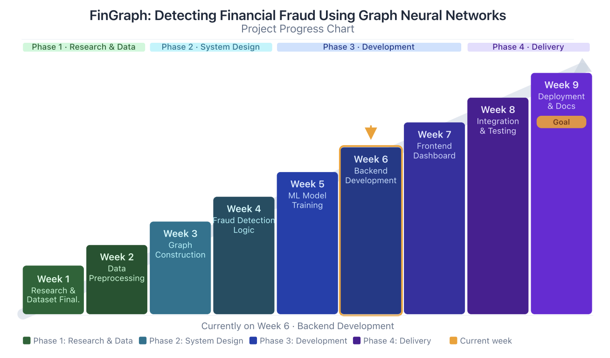
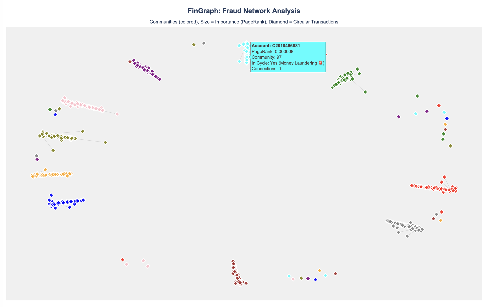

<div align="center">

```text
███████╗██╗███╗   ██╗ ██████╗ ██████╗  █████╗ ██████╗ ██╗  ██╗
██╔════╝██║████╗  ██║██╔════╝ ██╔══██╗██╔══██╗██╔══██╗██║  ██║
█████╗  ██║██╔██╗ ██║██║  ███╗██████╔╝███████║██████╔╝███████║
██╔══╝  ██║██║╚██╗██║██║   ██║██╔══██╗██╔══██║██╔═══╝ ██╔══██║
██║     ██║██║ ╚████║╚██████╔╝██║  ██║██║  ██║██║     ██║  ██║
╚═╝     ╚═╝╚═╝  ╚═══╝ ╚═════╝ ╚═╝  ╚═╝╚═╝  ╚═╝╚═╝     ╚═╝  ╚═╝
```

**Graph-Based Financial Fraud Detection**

[](https://python.org)
[](https://scikit-learn.org)
[](https://networkx.org)
[](https://plotly.com)
[]()

*Detecting suspicious financial activity using transaction graphs, rule-based scoring, and baseline machine learning models.*

</div>

---

## What Is FinGraph?

FinGraph is a university project focused on detecting financial fraud using graph-based analysis and machine learning. Instead of treating every transaction as an isolated row, the project represents transactions as a directed network:

- accounts are treated as nodes
- transactions are treated as directed edges
- edge direction represents money movement from sender to receiver
- edge attributes store amount, transaction count, and fraud information

This makes it possible to study fraud patterns through account relationships, important accounts, suspicious clusters, and transaction behavior.

The project is being developed as a 9-week workflow. Weeks 1-5 are complete, and Week 6 backend development has started. Frontend dashboard, integration, and final documentation are planned for Weeks 7-9.

Important note: the current system is mainly a **batch analysis and training pipeline** with a Week 6 API layer for serving model outputs and single-transaction predictions. It is not a full real-time production system yet.

---

## Progress Chart

<p align="center">
  
</p>

---

## Week 5 Results

The Week 5 machine learning pipeline was trained on a 200,000-row sample from the Kaggle transaction dataset.

| Item | Value |
|------|-------|
| Transactions used | 200,000 |
| Fraud cases in sample | 147 |
| Train/test split | 75% / 25% |
| Best model | Random Forest |
| Precision | 1.0000 |
| Recall | 0.9730 |
| F1-score | 0.9863 |
| Average precision | 0.9947 |

Random Forest was selected as the best baseline model because it gave a better balance between precision and recall than Logistic Regression.

Confusion matrix for the Random Forest model on the 50,000-row test set:

```text
                    Predicted: Legitimate    Predicted: Fraud
Actual: Legitimate        49,963                   0
Actual: Fraud                  1                  36
```

This means that, on the current test sample, the model correctly identified 36 out of 37 fraud cases and did not falsely flag legitimate transactions as fraud.

---

## Project Pipeline

```mermaid
flowchart LR
    A["Raw Kaggle Transactions"] --> B["Data Loading & Cleaning"]
    B --> C["Directed Transaction Graph"]
    C --> D["Graph Analysis<br/>PageRank, Louvain, Cycles"]
    D --> E["Rule-Based Fraud Scoring"]
    E --> F["ML Feature Preparation"]
    F --> G["Model Training<br/>Logistic Regression, Random Forest"]
    G --> H["Metrics, Predictions & Saved Model"]
    H --> I["FastAPI Backend"]
    I --> J["Planned Frontend Dashboard"]
```



The training pipeline runs in batch mode. The Week 6 backend serves saved model artifacts and prediction responses for future dashboard integration.

---

## Current Outputs

| Area | Output | Purpose |
|------|--------|---------|
| Graph visualisation | `advanced_fraud_network.html` | Interactive network view with account communities and PageRank sizing |
| Week 4 fraud logic | `week4_suspicious_transactions.csv` | Ranked suspicious transactions with explainable reasons |
| Week 4 account ranking | `week4_suspicious_accounts.csv` | High-risk accounts based on graph and transaction behavior |
| Week 5 ML metrics | `week5_model_metrics.json` | Model performance, confusion matrix, and evaluation details |
| Week 5 predictions | `week5_top_predictions.csv` | Highest-risk model predictions for inspection |
| Week 5 feature importance | `week5_feature_importance.csv` | Most useful features learned by the Random Forest model |
| Week 5 saved model | `week5_fraud_model.pkl` | Local trained model file for later backend integration |

Generated data and model files are kept local and ignored by GitHub.

---

## Fraud Network Visualisation

The project includes an interactive Plotly network visualisation generated during Week 3. It shows account communities using different colors, scales nodes using PageRank importance, and marks circular transaction involvement using diamond-shaped nodes.

<p align="center">
  <a href="advanced_fraud_network.html">
    
  </a>
</p>

Open [`advanced_fraud_network.html`](advanced_fraud_network.html) from the repository or locally in a browser to inspect the interactive version.

---

## Project Structure

```text
FinGraph/
├── backend/
│   ├── app.py                         # FastAPI application entry point
│   ├── routes.py                      # FastAPI route definitions
│   ├── schemas.py                     # Request and response models
│   └── services.py                    # Model loading and prediction services
├── data/
│   ├── raw/
│   │   └── transactions.csv           # Local Kaggle dataset, not pushed to GitHub
│   └── processed/                     # Generated outputs, not pushed to GitHub
├── frontend/
│   └── src/
│       └── App.js                     # Planned for Week 7 frontend work
├── models/                            # Saved ML models, not pushed to GitHub
├── notebooks/
│   ├── 01_exploration.ipynb
│   └── 02_visualization.ipynb
├── src/
│   ├── data_loader.py                 # Basic dataset loading and statistics
│   ├── data_cleaner.py                # Data cleaning pipeline
│   ├── graph_builder.py               # Converts transactions into a directed graph
│   ├── fraud_detector.py              # Rule-based fraud scoring and account ranking
│   ├── advanced_graph_analysis.py     # PageRank, Louvain, centrality, cycle checks
│   ├── visualize_graph.py             # Basic suspicious network visualisation
│   ├── visualize_advanced_graph.py    # Advanced Plotly graph visualisation
│   ├── visualizer.py                  # Fraud distribution and transaction type charts
│   └── train_ml_model.py              # Week 5 ML training pipeline
├── tests/
│   ├── test_fraud_detector.py
│   └── test_ml_model_training.py
├── README.md
└── requirements.txt
```

---

## Weekly Progress

### Week 1 - Research And Setup

- Finalized the project idea: financial fraud detection using graph analysis and later GNN concepts.
- Selected the Kaggle online payment fraud detection dataset.
- Created the project structure with folders for backend, frontend, data, notebooks, source code, and tests.
- Started basic dataset exploration using `src/data_loader.py`.

### Week 2 - Data Cleaning And Graph Construction

- Created `DataCleaner` in `src/data_cleaner.py` for loading data, checking missing values, removing duplicates, filtering invalid amounts, and handling outliers.
- Created `GraphBuilder` in `src/graph_builder.py`.
- Converted transactions into a directed NetworkX graph where senders and receivers are nodes.
- Stored amount, transaction count, and fraud label information on graph edges.

### Week 3 - Advanced Graph Analysis

- Created `AdvancedGraphAnalysis` in `src/advanced_graph_analysis.py`.
- Added PageRank to identify important accounts in the transaction network.
- Added Louvain community detection to find account clusters.
- Added circular pattern detection to check for possible money movement loops.
- Created interactive Plotly visualisations such as `advanced_fraud_network.html`.

### Week 4 - Rule-Based Fraud Detection Logic

- Expanded `FraudDetector` in `src/fraud_detector.py`.
- Added transaction-level fraud risk scoring.
- Added explainable fraud reasons such as high-risk transaction type, balance mismatch, account emptied, and suspicious community.
- Added suspicious account ranking.
- Exported fraud results as CSV and JSON for future backend and dashboard use.

### Week 5 - Machine Learning Model Training

- Created `src/train_ml_model.py`.
- Prepared ML features from transaction columns and engineered fraud indicators.
- Trained two baseline models:
  - Logistic Regression
  - Random Forest
- Evaluated models using precision, recall, F1-score, average precision, ROC-AUC, and confusion matrix.
- Saved:
  - model metrics
  - top predictions
  - feature importance
  - best trained model

### Week 6 - Backend API Development

- Created a FastAPI backend in `backend/app.py`.
- Added API routes in `backend/routes.py`.
- Added request and response schemas in `backend/schemas.py`.
- Added model loading, artifact reading, and prediction services in `backend/services.py`.
- Exposed endpoints for health checks, model metrics, top predictions, feature importance, and single-transaction prediction.

### Week 7-9 Planned Work

- Week 7: Frontend dashboard.
- Week 8: Integration and testing.
- Week 9: Final documentation, report, presentation, and project cleanup.

---

## Dataset

Dataset used: Kaggle online payment fraud detection dataset by Jainil Shah.

Expected local path:

```text
data/raw/transactions.csv
```

The full dataset has around 6.36 million transactions. During development, smaller samples are used first so the logic can be tested quickly. The Week 5 model currently uses 200,000 rows by default.

The dataset is not pushed to GitHub because it is large. Anyone cloning the project should download the dataset separately and place it at the path above.

---

## Installation

Clone the repository:

```bash
git clone https://github.com/ashmit-rana/FinGraph.git
cd FinGraph
```

Create and activate a virtual environment:

```bash
python3 -m venv venv
source venv/bin/activate
```

Install dependencies:

```bash
pip install -r requirements.txt
```

---

## How To Run

Run Week 3 graph analysis:

```bash
python3 src/test_advanced_analysis.py
```

Run Week 4 fraud detection logic:

```bash
python3 src/run_week4_fraud_detection.py
```

Run Week 5 ML training:

```bash
python3 src/train_ml_model.py
```

Using the existing project virtual environment:

```bash
venv/bin/python src/train_ml_model.py
```

Run with a smaller sample:

```bash
venv/bin/python src/train_ml_model.py --nrows 50000
```

---

## Backend API

Week 6 adds a FastAPI backend that loads the Week 5 model artifacts and exposes JSON endpoints for frontend/dashboard use.

Run the backend:

```bash
venv/bin/uvicorn backend.app:app --reload
```

Open the automatic API documentation:

```text
http://127.0.0.1:8000/docs
```

Available endpoints:

| Method | Endpoint | Purpose |
|--------|----------|---------|
| GET | `/` | Project and model summary |
| GET | `/health` | Checks model, metrics, predictions, and feature-importance files |
| GET | `/metrics` | Returns Week 5 model evaluation metrics |
| GET | `/predictions/top` | Returns top model predictions |
| GET | `/features/importance` | Returns feature importance rankings |
| POST | `/predict` | Predicts fraud probability for one transaction |

Example prediction request:

```json
{
  "step": 1,
  "type": "TRANSFER",
  "amount": 2806.0,
  "oldbalanceOrg": 2806.0,
  "newbalanceOrig": 0.0,
  "oldbalanceDest": 0.0,
  "newbalanceDest": 0.0,
  "nameOrig": "C1420196421",
  "nameDest": "C972765878"
}
```

---

## Week 5 Output Files

Running the Week 5 script generates:

```text
data/processed/week5_model_metrics.json
data/processed/week5_top_predictions.csv
data/processed/week5_feature_importance.csv
models/week5_fraud_model.pkl
```

These files are generated locally and ignored by Git because they are outputs, not source code.

---

## Machine Learning Features

The Week 5 model uses transaction and engineered features:

- transaction step
- transaction amount
- old and new origin balances
- old and new destination balances
- origin balance error
- destination balance error
- origin account emptied flag
- transfer or cash-out flag
- amount-to-old-balance ratio
- transaction type

Graph features such as PageRank, community ID, and cycle membership are already part of the graph analysis work, but they are not yet fully merged into the Week 5 ML model. Adding those graph-derived features is a good improvement for later model versions.

---

## Why These Metrics Matter

Fraud cases are very rare in the dataset. Because of that, accuracy alone is not useful. A model could predict every transaction as legitimate and still get very high accuracy.

The project therefore focuses on:

- precision: how many predicted fraud cases were actually fraud
- recall: how many real fraud cases were caught
- F1-score: balance between precision and recall
- average precision: performance on rare fraud cases across thresholds
- confusion matrix: exact count of correct and incorrect predictions

---

## Key Design Decisions

### Why Graph Analysis?

Fraud can hide inside relationships between accounts. A graph helps find important accounts, connected communities, and suspicious movement patterns.

### Why Rule-Based Detection Before ML?

Rule-based detection is explainable. It helps create clear fraud reasons before training a machine learning model.

### Why Random Forest?

Random Forest performed better than Logistic Regression on the current Week 5 sample. Logistic Regression caught fraud cases but produced many false positives. Random Forest gave a stronger balance between precision and recall.

### Why Not Real-Time Yet?

The current system loads data, trains models, and saves outputs in batch mode. Real-time prediction needs backend APIs and frontend integration, which are planned for Weeks 6 and 7.

---

## Current Status

Completed:

- data loading
- data cleaning
- transaction graph construction
- graph analysis
- graph visualisation
- rule-based fraud detection
- suspicious transaction and account exports
- baseline ML model training
- model metrics and prediction exports

Planned:

- backend API
- frontend dashboard
- integration and testing
- final documentation and report
- possible GNN model experiments
